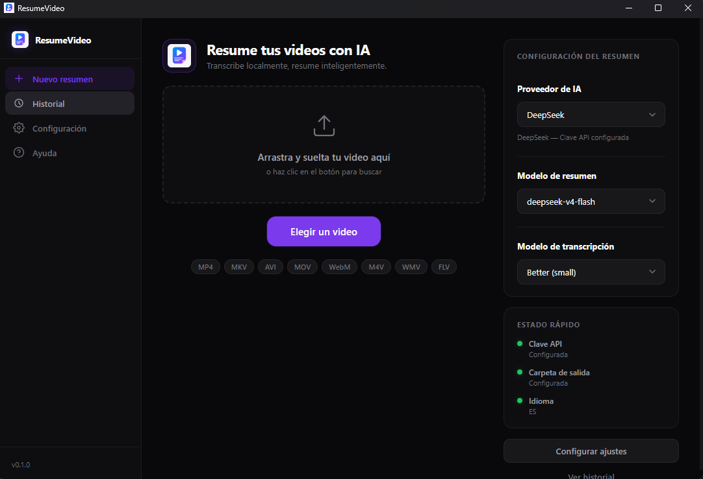
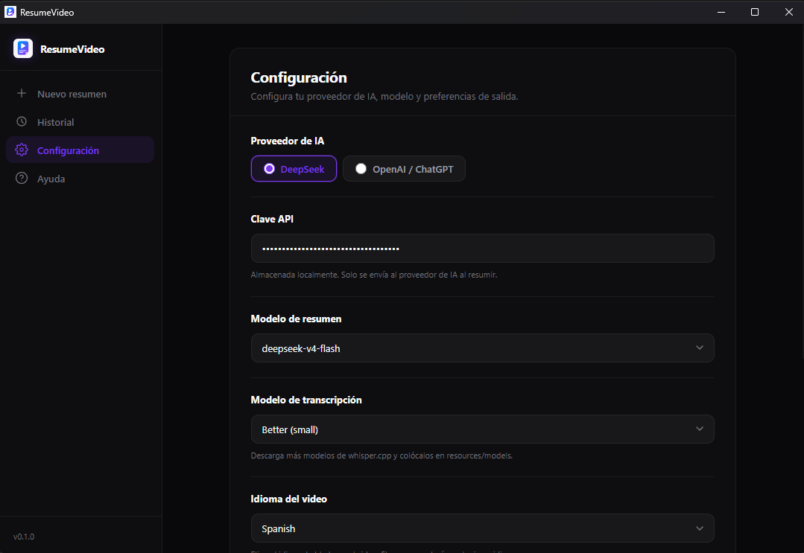
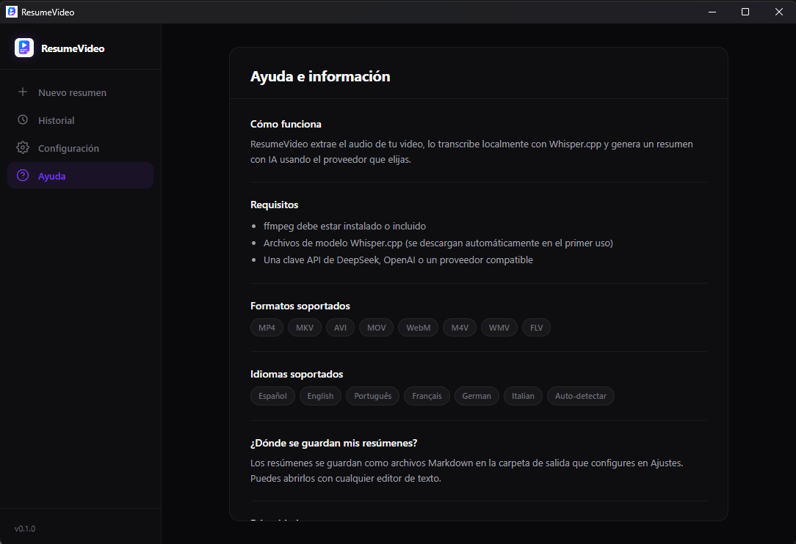

# ResumeVideo

Desktop application that summarizes video content using local transcription and AI.

## Screenshots

| Home | Settings | Help |
|------|----------|------|
|  |  |  |

## Features

- Drag & drop or browse any video file
- Local transcription using Whisper.cpp (offline, no internet required)
- AI summaries via DeepSeek, OpenAI, or any OpenAI-compatible API (bring your own API key)
- Auto-detects the video's spoken language and summarizes in that language
- Structured markdown output with key points, action items, decisions, dates, and more
- Adaptive AI prompt — sections vary based on content type (meeting, class, tutorial, interview, etc.)
- Live progress bar with time remaining and estimated completion
- Activity log showing each processing step in real time
- Fast (Base) or Better (Small) transcription quality
- **Multilingual UI**: English, Español, Português, Français
- Cross-platform: Windows, macOS, Linux

## Architecture

```
apps/desktop/          Electron + React + TypeScript + Vite desktop app
  src/main/            Main process (Node.js — window, IPC, processing pipeline)
  src/preload/         Secure bridge between main and renderer
  src/renderer/        React UI (dark theme)
packages/core/         Shared business logic
  src/ai/              OpenAI-compatible AI provider adapter
  src/prompts/         Adaptive summary prompt
  src/export/          Markdown export
resources/
  bin/                 Platform-specific binaries (ffmpeg, whisper.cpp)
  models/              Whisper model files
```

## Getting Started

### Prerequisites

- [Node.js](https://nodejs.org/) v20+
- [npm](https://www.npmjs.com/) v10+

### Install

```bash
git clone https://github.com/Nostalgic0/resumeVideo.git
cd resumeVideo
npm install
```

### Required Binaries

The app needs ffmpeg and whisper-cli to work. These are **not included in the repository** due to size.

| File | Purpose | Download |
|------|---------|----------|
| `resources/bin/{platform}/ffmpeg` | Audio extraction | https://ffmpeg.org/download.html |
| `resources/bin/{platform}/whisper-cli` | Local transcription | https://github.com/ggml-org/whisper.cpp/releases |
| `resources/models/ggml-base.bin` | Whisper model (Fast) | https://huggingface.co/ggerganov/whisper.cpp |
| `resources/models/ggml-small.bin` | Whisper model (Better) | https://huggingface.co/ggerganov/whisper.cpp |

Supported platforms: `win32`, `darwin`, `linux`. See [resources/README.md](resources/README.md) for detailed setup.

### AI Provider Setup

1. Go to **Settings** (gear icon in the sidebar)
2. Choose **DeepSeek** or **OpenAI / ChatGPT**
3. Paste your API key
4. Select your preferred model (e.g., `deepseek-chat`, `gpt-4.1-mini`)

Your API key is stored locally on your machine. It is never sent anywhere except to the AI provider you choose.

### Optional: App Language

In **Settings > App Language** you can switch the interface between English, Español, Português, and Français.

## Development

```bash
npm run dev            # Start Electron with hot reload
npm run build          # Build for production
npm run typecheck      # TypeScript type checking
npm run dist           # Package installers (.exe, .dmg, .AppImage)
```

## Tech Stack

| Layer          | Technology                     |
|----------------|--------------------------------|
| Desktop shell  | Electron                       |
| UI             | React 18 + TypeScript          |
| Build tool     | Vite + electron-vite           |
| Packager       | electron-builder               |
| State          | Zustand                        |
| Transcription  | Whisper.cpp (local)            |
| Audio          | ffmpeg / ffprobe               |
| AI API         | OpenAI-compatible (DeepSeek, OpenAI, Ollama, etc.) |
| Summary export | Markdown                       |

## Privacy

- Audio extraction and transcription happen **entirely offline** on your machine.
- Your video file never leaves your computer.
- Your API key stays local — it is only sent to your chosen AI provider when generating the summary.
- Only the **transcript text** is sent to the AI provider for summarization.

## License

MIT
